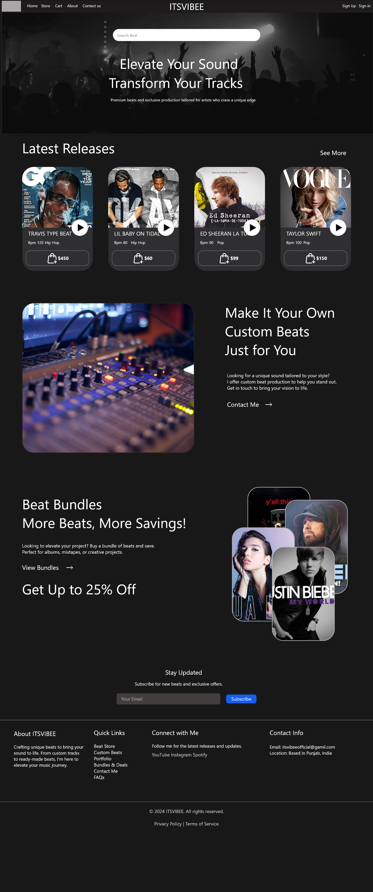
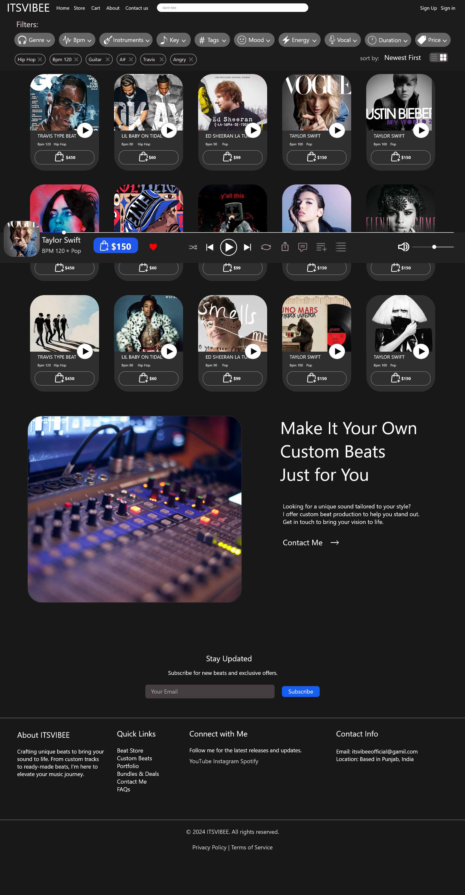
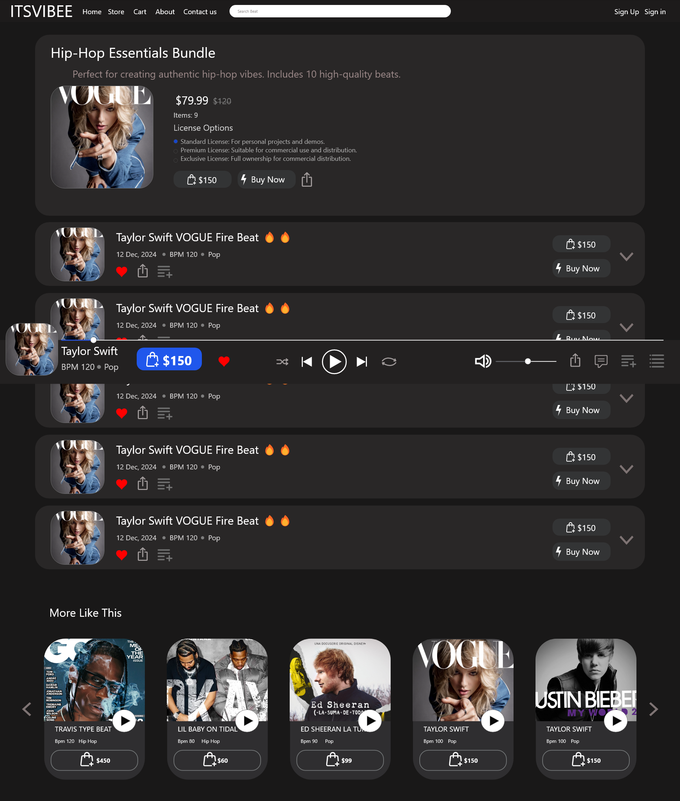
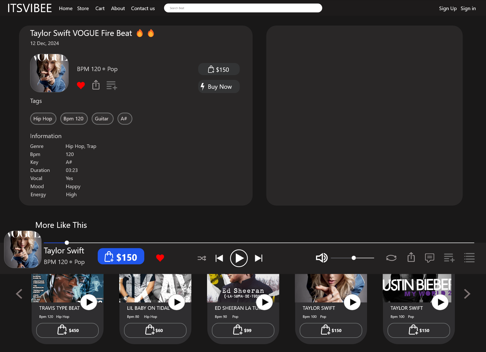
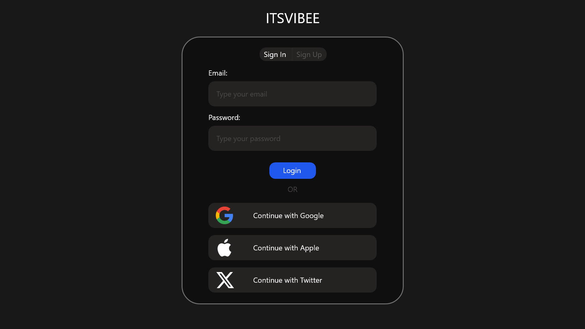
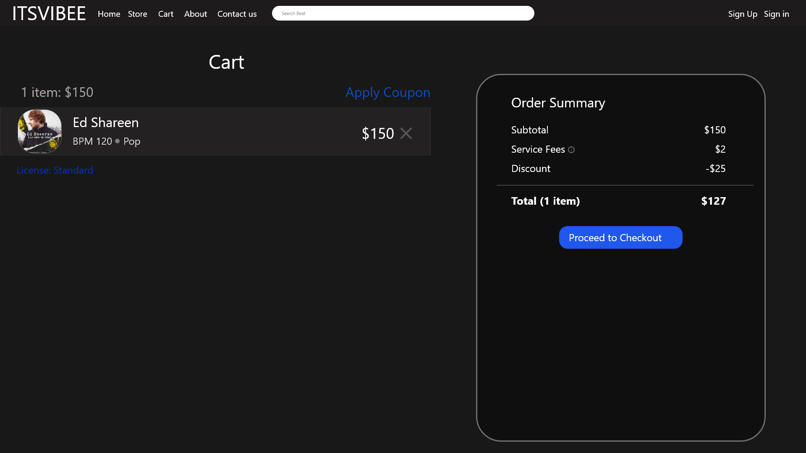
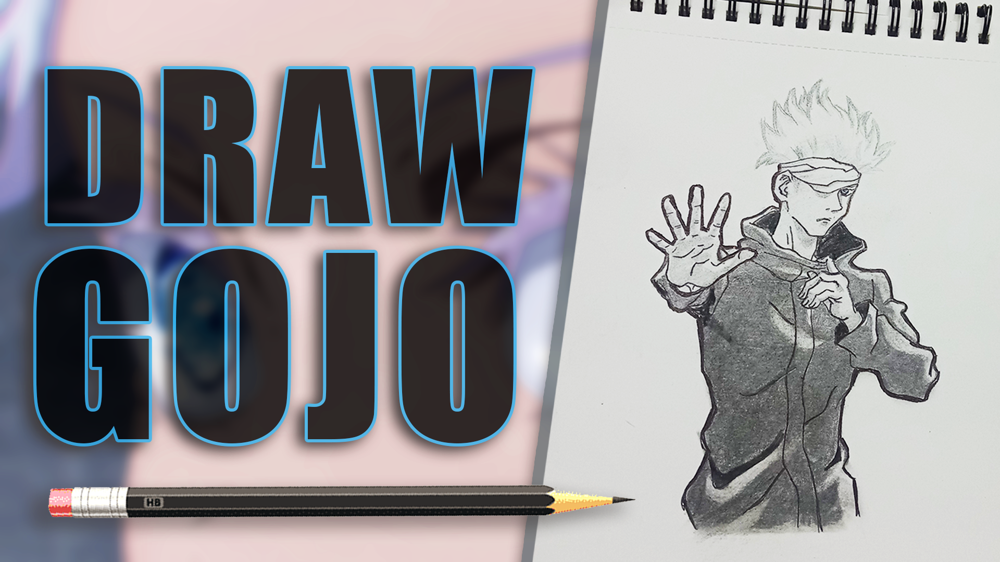

# 🎨 Harman’s Design Portfolio

Welcome to my design portfolio!  
Here you can explore my **UI/UX designs, thumbnails, banners, and logos**, along with my **video editing skills** showcased on YouTube.

---

## 📂 Projects & Designs

### 🖌️ UI/UX
- **ITSVIBEE_UI_UX**

  
  
  
  
  
  
  
  
  

---

### 🎬 Thumbnails (Design / Tech)

    
    
    
    
    

---

### 🎬 Thumbnails (Anime)

 
    
    
    
    
    
    
  
   
     

---

### 🍔 Banners, Posters, Logos & Brading

    
    
    
  
    
    

---

## 🎥 Video Editing Skills

Check out my video editing skills on my YouTube content:

- [Factory Design Pattern Video](https://youtu.be/A7uDNMusWCE?si=HAoXtG2IqxdpdyXm)  
- [Python Tips and Tricks](https://youtu.be/gQlOMjsnHnM?si=sP4JKhEaxc0OOkgZ)  

---

## 📺 YouTube Channels
- [HarmanBytes](https://youtube.com/@harmanbytes?si=Mumi0SI3uuPxKZao)  
- [TimeArt](https://youtube.com/@timeart_7?si=Z5OMfOh7dUE0qGU9)  

---

✨ *Thank you for checking out my work!*
